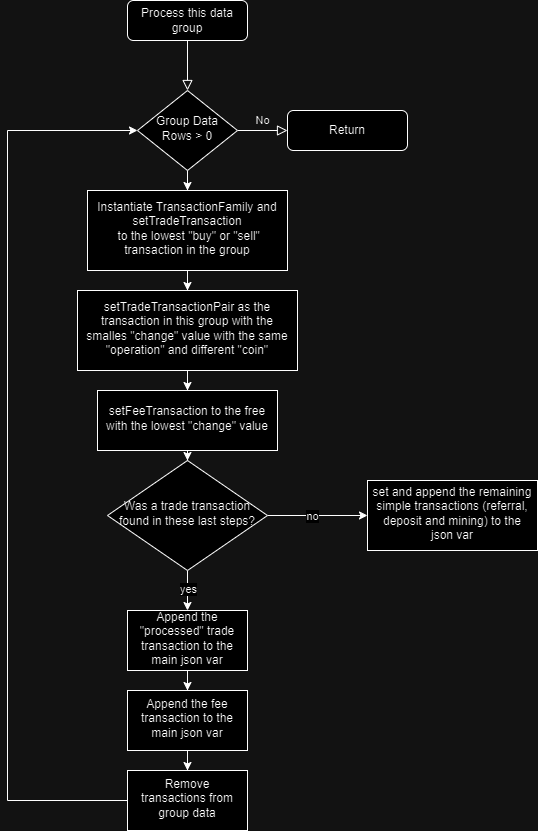

# Test Task

## How to run

- Update the .env file with the API key from CoinGecko (optional, but it's too slow without it)

```php
php CoinTrackingDemo.php Data\sample.csv
```
```php
php CoinTrackingDemo.php Data\sample.xls
```

## Specific Requirements:

- Read data from a sheet (csv or xls) to an array;
- Group data by date;
- Create transactions depending on the rules:
    - Transactions with the same timestamp are sorted crescently by the "change" value:
        - A buy or a sell has a pair in the same timestamp ("transforms" into a trade);
        - A pair is the smallest "change" value in the same timestamp with the same "operation" and different "coin";
        - A trade transaction is followed by a fee transaction (if any);
        - Followed by reward transaction (if any);
        - Followed by Deposit transaction (if any);
        - Followed by Mining transaction (if any);
- Each sell or buy key must be followed by a x_eur key with the value of the total amount of the transaction in EUR if the currency is different from EUR:
    - Fetch coin id from gecko API based on the coin name;
    - Fetch the price of the coin in EUR from gecko API at the time of the transaction;
- Needs to run from the command line;

## Assumptions:

- The same trade transaction cannot have transactions in different timestamps;
- A group does not have trades with more than 2 different coins;

## Thoughts

- May be worth considering refactoring the processGroup() algorithm:
    - It is a bit hacky;
    - The implementation of a Builder pattern for the creation of a transactionFamiliy may be a good idea for this purpose;
- May be worth consi
- More samples would be nice to have a better scope for testing and implementing unit tests;
- Error handling works for the most part, but it could be improved:
    - There are uncommon scenarios where, when not using an API key, the request doesn't seem to return a json object;

## Diagrams
### High level view

### Transactions Group Processing Algorithm

### Formating and Preparing each transaction from the group

### API Request and Response from transactions


## Libraries

- phpunit/phpunit
- vlucas/phpdotenv
- phpoffice/phpspreadsheet


